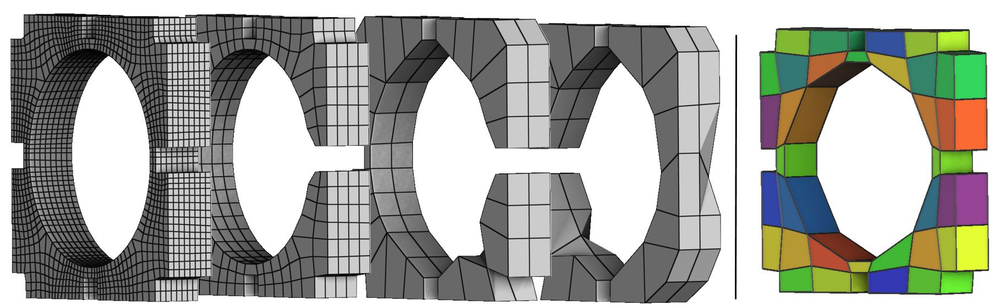
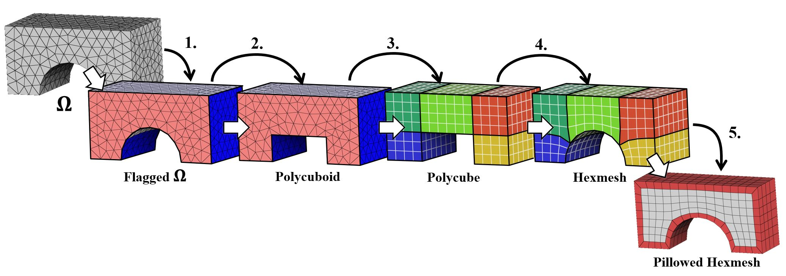
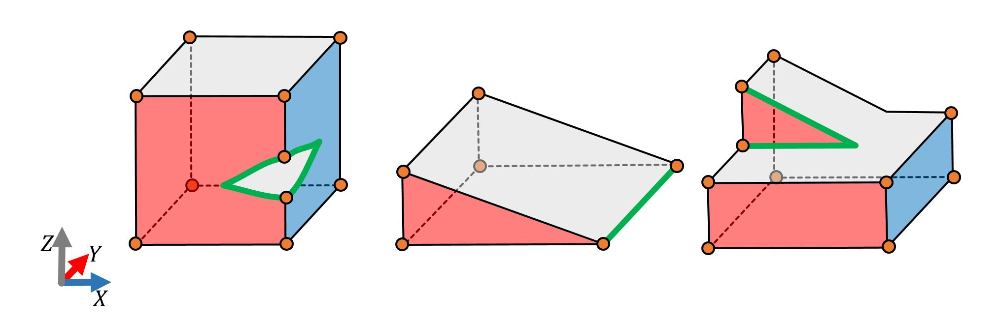

# Robust Quantization for Polycube-Maps



[François Protais](https://fprotais.github.io), [Maxence Reberol](https://mxncr.github.io/), Nicolas Ray, [Etienne Corman](https://members.loria.fr/ECorman/), Franck Ledoux and [Dmitry Sokolov](https://members.loria.fr/DSokolov/)
<br/>*Computer-Aided Design (Proceedings of SPM 2022)*<br/>
[https://doi.org/10.1016/j.cad.2022.103321](https://doi.org/10.1016/j.cad.2022.103321)

# Plan of this repo

This repository gives the code of the paper *Robust Quantization for Polycube-Maps* with some other tools for hexmeshing with polycube. I provide 5 binaries with libs you can link to. Let's first introduce polycube pipeline to give some context:



I consider the polycube pipeline as 5 steps: we start from a domain $\Omega$, that we flag (1.). This domain is then deformed to become a Polycuboid (2.), where its boundary is aligned with the axis. Then we extract a Polycube from this Polycuboid (3.), and we perform the inverse deformation to obtain an hexmesh of $\Omega$ (4.). We then perfom some pillowing and smoothing to improve the quality of hexahedra near the boundary (5.). To do this, we provide the following binaries:

1. `rb_generate_flagging` takes a domain and generates a basic flagging;
2. `rb_generate_deformation` takes a domain and a flagging and generates a bijective polycuboid;
3. Along with 5. is the main contribution of *Robust Quantization for Polycube-Maps*, we provide a single executable doing both:
4. `rb_generate_quantization` takes a domain, a flagging, and a polycuboid, with optionnaly a scaling and generate the corresponding hexmesh;
5. `rb_perform_postprocessing` takes the a domain and an hexmesh, and perfoms a pillowing and some smoothing to generate a higher quality hexmesh.

We as well provide `rb_fromscratch` that takes a domain and perfoms step 1. to 5..

In the following we present how to build the project, precise every binary, detail some external things that can be linked for debug or better quantization, give classic failure cases, and the talk about interesting future works.  


# Use CMake to build the project:
```sh
git clone --recurse-submodules https://github.com/fprotais/robustPolycube &&
cd robustPolycube &&
mkdir build &&
cd build &&
cmake -DCMAKE_BUILD_TYPE=Release .. &&
make -j 
```


# Binaries
We split our code into several binaries to help testing specific method. We use the Medit format (.mesh) as an example. For the supported IO mesh formats, see [ultimaille](https://github.com/ssloy/ultimaille). 
## `rb_generate_flagging` 
The code takes a surface or a volume and compute a basic flagging: every boundary triangles is given a flagging as the axis closest to its exterior normal. The corresponding code is in `bin/generate_flagging.cpp`.
```sh
./rb_generate_flagging ../mesh/B0.mesh B0.flag 
```
The flagging is an int per facet as 0 -> 5, {+X,-X,+Y,-Y,+Z,-Z}, -1 is no flagging.

If `B0.mesh` is a volume, `B0.flag` contains an int for each cell's facet of tetrahedron. For the numbering of the facets, I use the following vertex numbering `{1,2,3}, {0,3,2}, {0,1,3}, {0,2,1}` (ultimaille convention).

If `B0.mesh` is a surface, `B0.flag` contains an int for each facet. 

## `rb_generate_deformation` 
The code takes a surface or a volume with a flagging and computes a bijective(tries at least) polycuboid: points on a boundary triangle will have the same coordinate in the flag value. The corresponding code is in `bin/flagged_deformation.cpp`.
```sh
./rb_generate_deformation ../mesh/B0.mesh B0.flag B0_remesh.mesh B0_remesh.flag B0_polycuboid.mesh
```
If `B0.flag` is a surface, `B0_remesh.flag` will be the corresponding volume. 
/!\ For volume, we still perfom a remesh of the input mesh to ensure that it stays bijective. It is definitely sub-otpimal, see Failure cases and Future works.

`B0_polycuboid.mesh` is the the polycuboid of `B0_remesh.mesh` with flagging `B0_remesh.flag`. `B0_remesh.flag` and `B0.flag` are exactly equivalent. 

## `rb_generate_quantization` 
The code takes a volume with a flagging and polycuboid, with a element sizing, and extract an Hexmesh as detailled in *Robust Quantization for Polycube-Maps*. The corresponding code is in `bin/extract_mesh_from_deformation.cpp`.
```sh
./rb_generate_quantization B0_remesh.mesh B0_remesh.flag B0_polycuboid.mesh 1. B0_hexmesh.mesh
```
The "1." is the element sizing. It is a ratio compared to `B0_remesh.mesh` edge size. 1: hexmesh edge are the same, 0.1 smaller, 10 bigger. Smaller will lead to finer hexmesh, bigger to a coarser hexmesh. 
`B0_hexmesh.mesh` is the corresponding Hexmesh.

## `rb_perform_postprocessing` 
The code takes a volume with an hexmesh and add a pillowing layer to the hexmesh, and then tries to smooth the result. The corresponding code is in `bin/perform_postprocessing.cpp`.
```sh
./rb_perform_postprocessing B0_remesh.mesh B0_hexmesh.mesh B0_hexmesh_improved.mesh
```

`B0_remesh.mesh` and `B0_hexmesh_improved.mesh` must match for the boundary smoothing. This code can be standalone and can be used with any input Hexmesh. 

`B0_hexmesh_improved.mesh` is the resulting hexmesh.


## `rb_fromscratch` 
The code takes a volume or surface and perfom the whole pipeline. The corresponding code is in `bin/fullprocess.cpp`.
```sh
./rb_generate_quantization B0.mesh 1. B0_hexmesh.mesh
```
The "1." is the element sizing. To test flagging in an easy way, you can add `B0.flag` as a 4th argument. 

The perfomed code is equivalent to:

```sh
./rb_generate_flagging ../mesh/B0.mesh B0.flag 
./rb_generate_deformation ../mesh/B0.mesh B0.flag B0_remesh.mesh B0_remesh.flag B0_polycuboid.mesh
./rb_generate_quantization B0_remesh.mesh B0_remesh.flag B0_polycuboid.mesh 1. B0_inhexmesh.mesh
./rb_perform_postprocessing B0_remesh.mesh B0_inhexmesh.mesh B0_hexmesh.mesh
```
With first line ignored if flagging is given as input. 
# Libs

Binaries only handles IO and calls Libs in `lib/`. I do not detail here, but they should be easy to use. Do not hesitate to contact me if you have any question on how to do it, I would be very happy to help :)

# Linking with external tools
coming soon...

## MILP solvers

## Graphite

# Failure cases

## Invalid flagging

For the moment, the quantization is very sensible on invalid boundary flagging (but robust to flipped tetrahedra). There is 2 types of defect: 
1. Locally incoherent flagging, invalid charts

Note that it can happen with only 1 poorly flagged triangle, that will break our block extraction and give some strange result. I'll try to implement some cleaning procedure to reduce those problems. 
2. Globally incoherent flagging

The green path on the image will need to be higher than itself, which makes the block extraction impossible. This is actually quite difficult to fix. They try to do it [here](https://hal.inria.fr/hal-01211408/document). 

## Non bijective mapping (overlaps)
coming soon...

# Future works
- Ovelaps in input polycuboid:
	- Improved voxelisation
	- Deformation that is only injective, without tetgen (add exiting normal constraints)
	- Check that function are actually compatible
- Improve flagging: link with other works or graphcut?
- Custom integer solver to remove MILP solvers
- Make some selective padding and improving smoothing


# TODO
- Splitting potentially bad tets: something similar to [this](https://github.com/fprotais/preprocess_polycube), but more efficient
- Finish incomplete functions
- Improve handling graphite and LinearSolver 
- add a HexEx alternative for comparison

